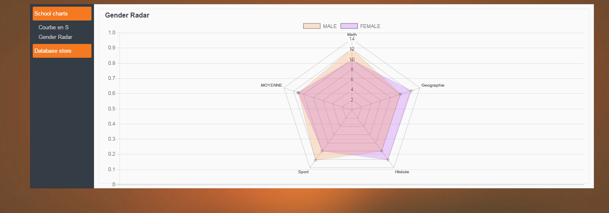
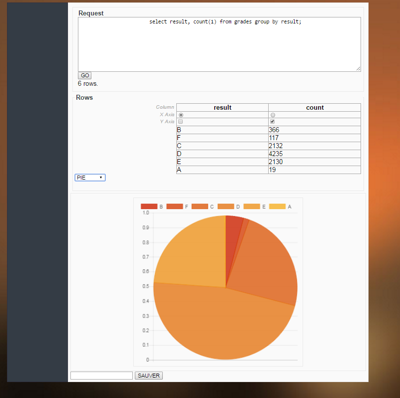

# VIZIR

Vizir is a java library meant to streamline chart creation and display.
It is intended to be used in SpringBoot applications.

## Features
### Current features
* Rapid [integration of existing charts](#Integration) in JSP pages.
* Easy coding of new charts from [java code](#Java)
* Admin application allowing:
  * the listing of all charts defined in the application,
  * creation of new charts based on SQL query.

### Work in progress
 * Creation of charts direclty from collections of annotated objects
 * Creation of reports, combining different charts
 * Allowing to define variables in charts, and update chart display on variable change

## Integration
  
A tld file is included. Adding a chart to your page is done by adding the tag and specifyong the chart name :
```html
<fieldSet style="height: 400px;" id="fs">
	<legend id="chartName"></legend>
	
	<!-- Display of the chart named 'test' in the page : -->
    <vz:chart name="test" load="false" />
</fieldSet>
`````

## Java
In order to make new charts available from you application code directly, you must create a new implementation of the ChartProvider interface.

In this interface, you can then manually define your chart :
````java
		RestChart sCurve = new RestChart(ChartType.LINE,"S Curve");
		DataSet ds = new DataSet("S Curve");
		sCurve.getData().getDatasets().add(ds);
		for(Float i = 0.0f ; i <=20.0f ; i++){
			sCurve.getData().getLabels().add(i+"");
			ds.getData().add((double) repo.countByAverageGreaterThan( i ));
		}
		return sCurve;
````

## Listing

The admin application allow a quick display of all charts defined.



## Creating

The admin application allow a quick creation of charts from SQL queries.
Type your query, select your X axis and your Y axis, the type of chart, and see the result immediately.

